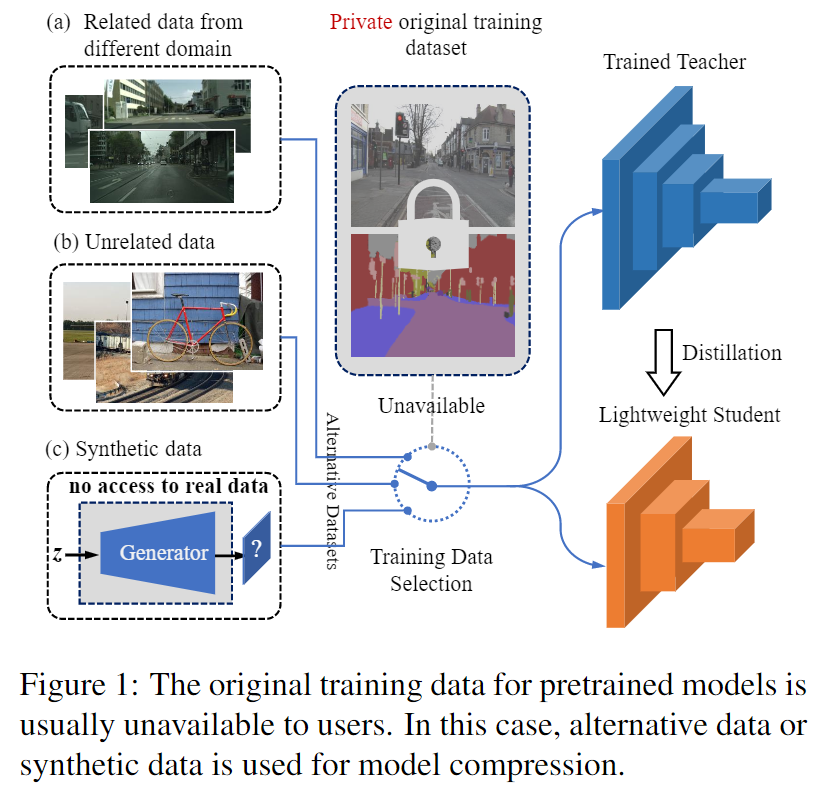
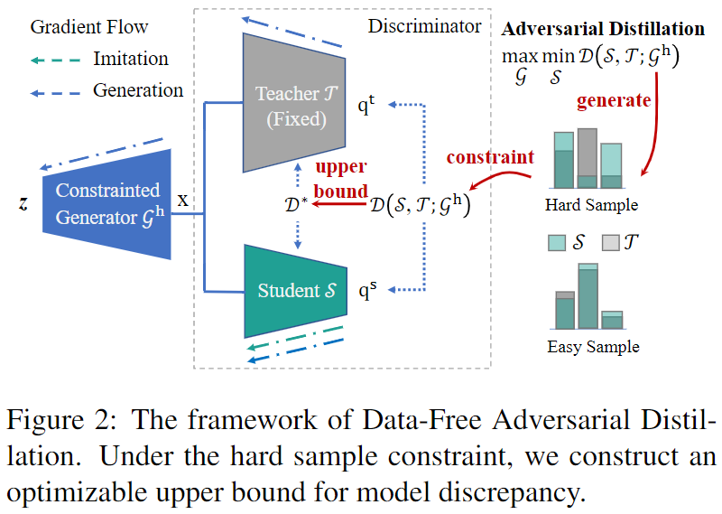
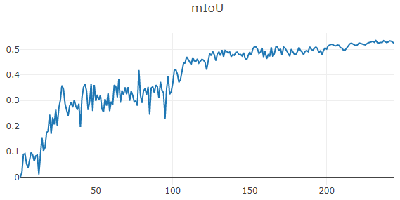
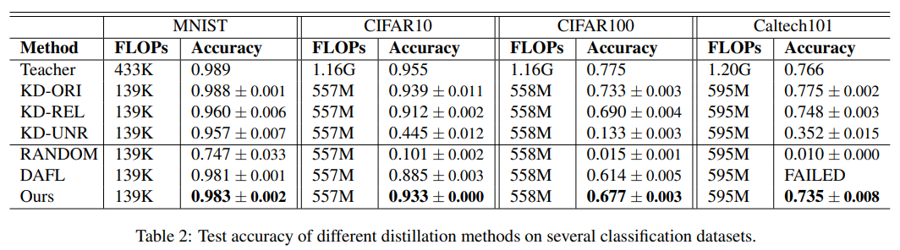
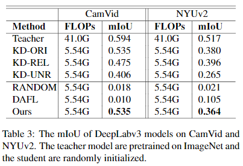

# Data-Free Adversarial Distillation [[pdf](https://arxiv.org/abs/1912.11006)]

_Gongfan Fang, Jie Song, Chengchao Shen, Xinchao Wang, Da Chen, Mingli Song_

**!!Note**: We found that a similar work has been published before ours: https://arxiv.org/abs/1905.09768.  If you find that our work is useful for your research, please consider citing **their paper first**. 

DFAD aims to learn a comparable student model from a pretrained teacher model **without any real-world data**. Inspired by human learning behavior, we set up a min-max game between the student, the teacher and a generator. In this game, the generator poses several difficult questions (**_"hard samples"_**), while the student model learns how to answer those questions from the teacher model. With those hard samples (the hard sample constraint), we can approximately estimate the upper bound of the true model discrepancy between the teacher and the student, and optimize it to train the student model.

<div align="center">


</div>


## Requirements

```bash
pip install -r requirements.txt 
```

## Quick Start: MNIST

We provide an MNIST example for DFAD, which only takes a few minutes for training. Data will be automatically downloaded.

```bash
bash run_mnist.sh
```

or 

```bash
# Train the teacher model
python train_teacher.py --batch_size 256 --epochs 10 --lr 0.01 --dataset mnist --model lenet5 --weight_decay 1e-4 # --verbose

# Train the student model
python DFAD_mnist.py --ckpt checkpoint/teacher/mnist-lenet5.pt # --verbose
```

## Step by Step

### **0. Download Pretrained Models (optional)**

You can download **our pretrained teacher models** from [Dropbox](https://www.dropbox.com/sh/xh9eqq0iknagwwc/AACTQGte7hecIcr-DexD7z9ea?dl=0) and extract the .pt files to *./checkpoint/teacher/*. 

### **1. Prepare Datasets**

Download datasets from the following links and extract them to *./data*:

#### Caltech101 

1. Download [Caltech101](http://www.vision.caltech.edu/Image_Datasets/Caltech101) and extract it to *./data/caltech101*
2. Split datasets
    ```bash
    cd data
    python split_caltech101.py
    ```

#### CamVid

1. Download [CamVid](https://github.com/alexgkendall/SegNet-Tutorial/tree/master/CamVid) and extract it to *./data/CamVid*

#### NYUv2

1. Download [NYUv2](https://cs.nyu.edu/~silberman/datasets/nyu_depth_v2.html) and extract it to *./data/NYUv2*
2. Download [labels (13 classes)](https://github.com/ankurhanda/nyuv2-meta-data) and extract it to *./data/NYUv2/nyuv2-meta-data*


### **2. Train teachers and students**

Start the visdom server on port 15550 for visualization. You can visit [127.0.0.1:15550](127.0.0.1:15550) to check training logs. In distillation, we validate our models every 50 iterations. For the sake of simplicity, we regard such a period as an **"epoch"**.

```bash
visdom -p 15550
```


#### CIFAR

* CIFAR10

```bash
# Teacher
python train_teacher.py --dataset cifar10 --batch_size 128 --step_size 80 --epochs 200 --model resnet34_8x

# Student
python DFAD_cifar.py --dataset cifar10 --ckpt checkpoint/teacher/cifar10-resnet34_8x.pt --scheduler
```

* CIFAR100

```bash
# Teacher
python train_teacher.py --dataset cifar100 --batch_size 128 --step_size 80 --epochs 200 --model resnet34_8x

# Student
python DFAD_cifar.py --dataset cifar100 --ckpt checkpoint/teacher/cifar100-resnet34_8x.pt --scheduler
```

#### Caltech101

```bash
# Teacher 
python train_teacher.py --dataset caltech101 --batch_size 128 --num_classes 101 --step_size 50 --epochs 150 --model resnet34

# Student
python DFAD_caltech101.py --lr_S 0.05 --lr_G 1e-3 --scheduler --batch_size 64 --ckpt checkpoint/teacher/caltech101-resnet34.pt
```

#### CamVid

```bash
# Teacher
python train_teacher_seg.py --model deeplabv3_resnet50 --dataset camvid --data_root ./data/CamVid --scheduler --lr 0.1 --num_classes 11

# Student
python DFAD_camvid_deeplab.py --ckpt checkpoint/teacher/camvid-deeplabv3_resnet50.pt --data_root ./data/CamVid --scheduler
```

Our segmentation experiments require 10 GB memory with a batch size of 64 on a single Quadro P6000. The learning rate will be decayed at 100 epochs and 200 epochs and the mIoU reaches 0.5346 at 232 epochs.
<div align="center">

</div>

#### NYUv2
```bash
# Teacher
python train_teacher_seg.py --model deeplabv3_resnet50 --dataset nyuv2 --data_root ./data/NYUv2 --scheduler --lr 0.05 --num_classes 13

# Student
python DFAD_nyu_deeplab.py --ckpt checkpoint/teacher/nyuv2-deeplabv3_resnet50.pt --data_root ./data/NYUv2 --scheduler
```

## Results

<div align="center">

<br>

</div>

_Note: Batch size has a great influence on the results. We use a small batch size (e.g. 256 for CIFAR-10) in our experiments, so the accuracy of DAFL is lower than that of the original paper._

## Citation
```
@article{fang2019datafree,
    title={Data-Free Adversarial Distillation},	
    author={Gongfan Fang and Jie Song and Chengchao Shen and Xinchao Wang and Da Chen and Mingli Song},	  
    journal={arXiv preprint arXiv:1912.11006},	
    year={2019}
}
```

## Acknowledgement

* ResNet, LeNet and GeneratorA from [Data-Efficient-Model-Compression](https://github.com/huawei-noah/Data-Efficient-Model-Compression)  
* MobileNetv2 from [pytorch-deeplab-xception](https://github.com/jfzhang95/pytorch-deeplab-xception)
* DeepLabv3 from [torchvision](https://github.com/pytorch/vision)
